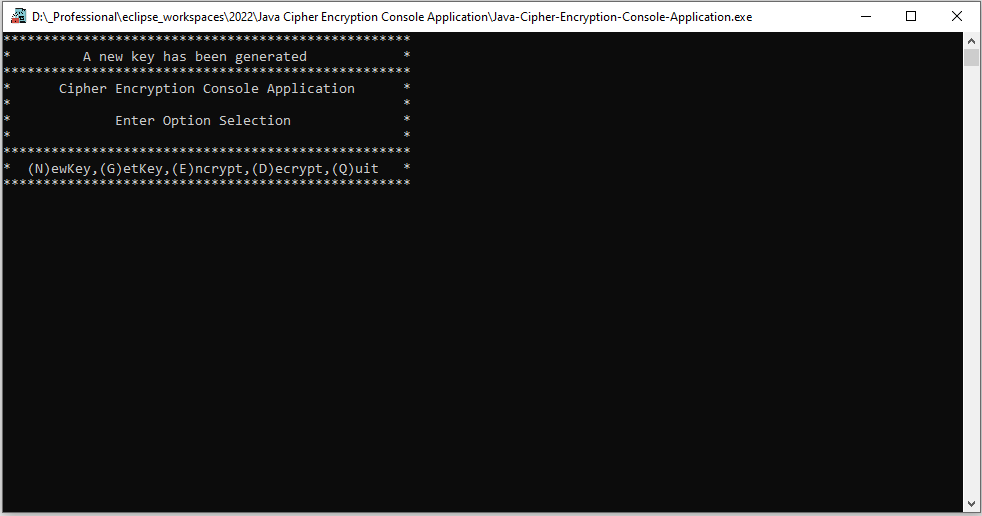
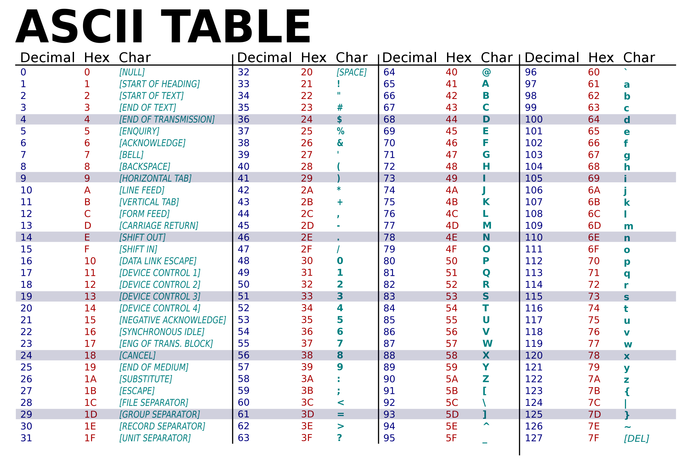

</a>

# Java Cipher Encryption Console Application

# Table of Contents

- [Java Cipher Encryption Console Application](#java-cipher-encryption-console-application)
- [Table of Contents](#table-of-contents)
- [Screenshot of the Application](#screenshot-of-the-application)
- [ASCII Table](#ascii-table)
- [Description](#description)
- [Scope](#scope)
- [Instructions](#instructions)
- [System requirements](#system-requirements)
- [Source Code](#source-code)
- [Running the application as an executable](#running-the-application-as-an-executable)

---

# Screenshot of the Application

 
 

# ASCII Table

 

# Description

Console Application using a pre-shared key to pair with random secret key to ensure secure of encryption substitututing each character with a random key. ArrayLists are used as Data structures for characters.
The application is wrapped as an executable application (.exe) using Launch4j and ready to go.

# Scope

Based on the ASCII table, each character has integer value, 0-31 not being used; key characters from 32-126 for this encryption program.

# Instructions

The application generates a random array of characters to be used as a unique key for use with encryption and decryption of plain text.
As the key is already generated, an encryption process of plain text can begin. The user is also provided with additional options as follows:

- New Key
  - Generate Key for Encryption/Decryption of Message
- Get Key
  - Generate New Key by a Reshuffle letters from ArrayList
- Encrypt
  - Retrieve Plaintext message from user console input add to ArrayList and reshuffle
- Decrypt
- Quit

The only way to decrypt cipher text is by using the Key used to Encrypt the Message to Decrypt the message.

# System requirements

- JavaSE-1.8 or higher.

# Source Code

The project was developed in Eclipse IDE and all source code and projects are uploaded as an Eclipse project for convenience.

- Source code is available to view in the src folder
- Compiled code located in the bin directory.
- Jar File
- Executable (.exe) File
- Doc's file (javadocs)

# Running the application as an executable

As the project has already been compiled into an executable file, all you need to is:

- download the project and run Java-Cipher-Encryption-Console-Application.exe
- all other files are not required unless you wish to inspect the source code.
